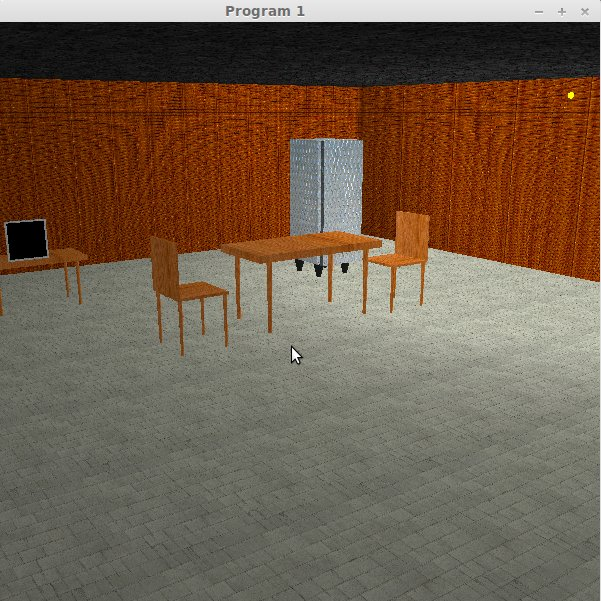

<html><head>
<meta http-equiv="content-type" content="text/html; charset=windows-1252"></head><body>

<h2>Introduction</h2>
This assignment aims at developing a complete 3D animation scene involving a music box, a 3D model of humanoid doll, and surroundings involving furniture and room using C++ OpenGL library. 
To watch the complete video click <a href="http://www.youtube.com/watch?v=f0XBXGU78V4&amp;feature=youtu.be" target="_blank"> here </a>
<h3>Quick Go-through</h3>
The following are the building blocks of our project:
<ul>
	<li> <b>Humanoid Doll</b>  
	This is a hierarchical model of a humanoid, named Lobo,
 having various body parts like torso, head, shoulders, hands, arms, legs, feet, etc. Degree of freedom for these body parts tells us the number of dimensions in which the motion can occur e.g. it's 3 for shoulders and hips and 1 for elbows and knees.  
	The root of this hierarchical model is the torso, about which every other body part is properly translated and rotated. As in hierarchical structure, each body part depends just on its immediate parent body part and all its movements are defined in its terms only.
	</li>
	

	
	
	
	

	<li> <b> Music Box </b>  
	Lobo is placed inside this music box. This box is a simple 3D cuboid that has an openable lid.
	</li>
	    
	<li> <b> Furniture </b>  
	Following furnitures have been modeled and placed in the scene.
	<ul>
		<li> Two Tables </li>
		<li> Television </li>
		<li> Wardrobe </li>
		<li> Chairs </li>
	</ul>
	</li>
	    
	<li> <b> Textures </b>  
	Appropriate textures are applied on different body parts, furnitures and walls.  
	</li>
	
	    
	<li> <b> Lights </b>  
	There are two light sources defined in our environment. First is a table lamp situated at the left side of the room and the other a light bulb at top right corner.
	The overall lighting effect in our project is due to these two lights. We have implemented "Phong illumination model" in this assignment, with linear attenuation based on distance.  
	We have implemented all three forms of lighting - ambient, diffused and specular. They can be switched on and off with pre-specified keys.
	</li>
	
	    
	<li> <b>Camera</b>  
	This is the viewing position of the whole scene. By default, it is situated at a proper location so as to view the room from outside.
	We have provided feature to move the camera on a smooth Bezier curve. The user can define the control points for the same.
	</li>
	    
</ul>

<h3> Controls </h3>

The following are the functionalities provided by us, to dynamically render various parts of the scene.
All the mapped keys are defined here.
<ul>
	<li> Doll  
	Keys are mapped as to various body parts according to the keyboard layout.
		<ul>
			<li> Top row: `q` `w` `e` `r` `t` `y` `u` `i` `o` - These are mapped 
to head, torso1 and torso3 respectively, each with there three degree of
 freedom. </li>
			<li> Middle Row: `a` `s` `d` `f` `g` `h` `j` - These are mapped to upper arm, lower arm (one degree of freedom) and hand. </li>
			<li> Bottom Row: `z` `x` `c` `v` `b` `n` `m` - These are mapped to thigh, leg(one degree of freedom) and foot. </li>
			<li> `k` `l` `;` `m` `,` `.` - These are used to rotate and translate the body as a whole in three directions respectively.</li>
			<li> `-` `+` are used to change the direction of rotation of body parts. </li>
			<li> `[` `]` are used to change the side of the body part. For example, by default, pressing `a` will rotate the left upper arm on x axis, while after pressing `]`, pressing `a` will rotate the right upper
 arm.</li>
		</ul>
	</li>
	<li> Camera  
	Camera can be controlled by using the following keys:
		<ul>
			<li>`UP` and `DOWN` arrow keys move the camera in negative and positive `z` direction respectively.</li>
			<li>`LEFT` and `RIGHT` arrow keys move the camera in negative and positive `x` direction respectively.</li>
			<li>`PAGEDOWN` and `PAGEUP` keys move the camera in negative and positive `y` direction respectively.</li>
			<li>Camera can be animated on a bezier curve.   
			To set the control points, move the camera using the control keys defined above and to fix a control point left-click on the screen. This will create a control point at that x, y, z coordinate. After creating required number of control points, right-click on the screen anywhere will start the animation on bezier curve.</li>
		</ul>
	</li>
	<li> Lights  
	Lights can be controlled using:
		<ul>
			<li>Table lamp can be toggled using `NUMKEY1`</li>
			<li>Bulb can be toggled using using `NUMKEY2`</li>
		</ul>
	</li>
	<li> Music Box  
	The lid of music box can be controlled using `p` key. If left side is selected using `[` key, lid closes gracefully and vice versa.
	</li>
	<li> Keyframes</li>
	To animate our model and environment, we have added the current values of all degree of freedom of the scene viz. body parts, lights, etc to a file. To add a keyframe to the buffer, press key `3`. At the end to save all the given keyframes to the file `keyframes.txt` press `4`.  
	Two subsequent keyframes are linearly interpolated for about 100 frames and are displayed on the screen, giving smooth animation effect. 
	On loading, to animate the scenes using the stored keyframes, press key `5`.
</ul>

<h3> Another set of textures applied </h3>

</body></html>